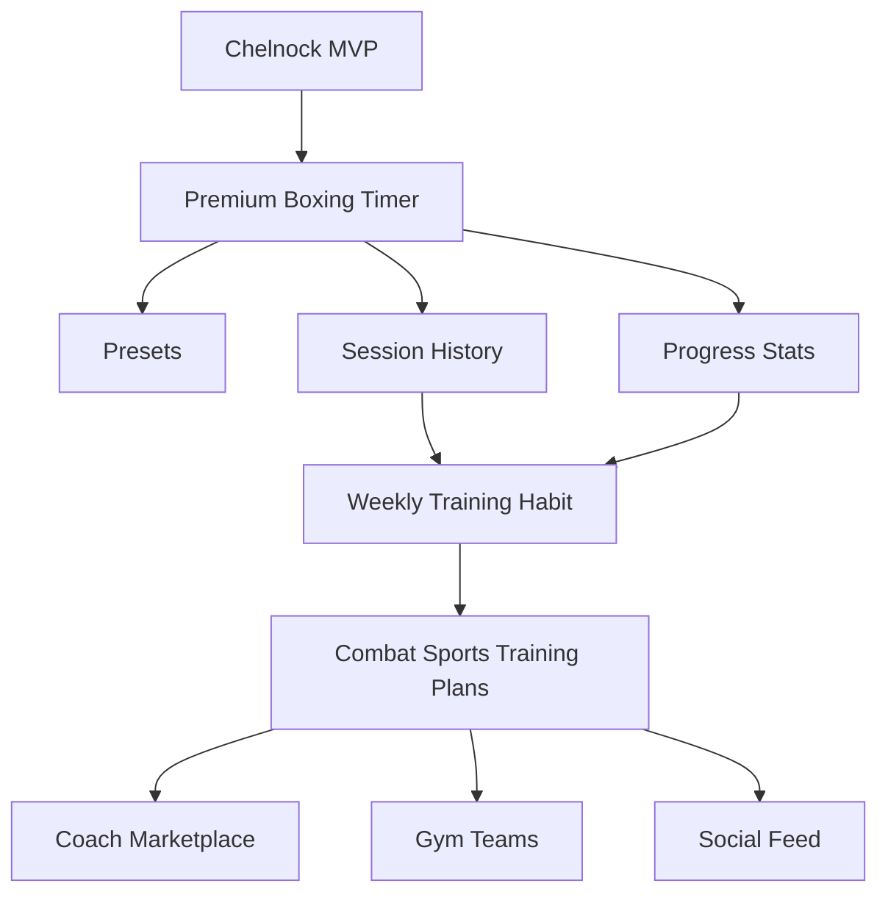

# Chelnock Plan

Chelnock goal: become the best boxing timer first, then grow into the combat sports training app people open every week, like Runna or Strava but for fighters.

This file is the product map and beginner-friendly engineering guide. Update it as the app changes.

## Product North Star

Chelnock should help fighters do better training sessions with less thinking:

- Start a clean boxing timer in seconds.
- Build repeatable workouts: rounds, rest, prep, intervals.
- Track sessions over time.
- Make progress visible and motivating.
- Later: coach plans, gym groups, leaderboards, social feed, wearables.

## First Target

Do not try to build Strava on day one. First dominate one small thing:

> The most polished boxing round timer on mobile.

If the timer feels premium, reliable, loud, readable, and fast, the rest of the app has a strong foundation.

## Visual Direction

Reference from the shared file: elegant fitness timer, tall mobile layout, dark premium feel.

Design principles:

- Dark background, high contrast, large timer.
- One primary accent color for active actions.
- Big touch targets for sweaty/gloved gym use.
- Minimal text while training.
- Clear states: setup, ready, running, resting, paused, finished.
- Timer screen first, no marketing screen.

Suggested first screen:

```text
+--------------------------------+
| Chelnock                 icon   |
|                                |
|          ROUND 1 / 3            |
|                                |
|          02:47                  |
|                                |
|        [ circular progress ]    |
|                                |
|  Work: 3:00     Rest: 1:00      |
|  Rounds: 3      Prep: 0:10      |
|                                |
|       [ Start / Pause ]         |
|                                |
|  Presets   History   Settings   |
+--------------------------------+
```

## MVP Scope

Version 0.1 should include:

- Timer setup: work duration, rest duration, number of rounds, prep duration.
- Timer engine: start, pause, resume, reset, finish.
- Round state display: prep, work, rest, finished.
- Audio or vibration hooks later, even if the first version only logs/beeps.
- Presets: Boxing 3x3, Boxing 5x3, Muay Thai 5x3, Custom.
- Local session history: date, preset, total time, completed rounds.
- Clean visual design matching the premium timer direction.

Not MVP yet:

- Accounts.
- Cloud sync.
- Social feed.
- Payments.
- AI plans.
- Coach dashboard.
- Wearables.

## App Architecture

Keep `main.dart` small. It should start the app, not contain the whole app.

Recommended structure:

```text
lib/
  main.dart
  app/
    chelnock_app.dart
    theme.dart
  features/
    timer/
      data/
        timer_presets.dart
      domain/
        round_timer_config.dart
        timer_phase.dart
        timer_snapshot.dart
      logic/
        round_timer_controller.dart
      presentation/
        timer_screen.dart
        widgets/
          timer_display.dart
          timer_controls.dart
          timer_setup_panel.dart
    history/
      domain/
        training_session.dart
      presentation/
        history_screen.dart
```

Why this structure:

- `domain` means pure app ideas: config, phase, session. These files should not care about Flutter UI.
- `logic` means behavior: ticking timer, moving from work to rest, resetting.
- `presentation` means widgets: what the user sees and taps.
- `data` means where things come from: default presets now, local database later.

This keeps the app understandable when it grows. One giant `main.dart` feels fast for one day, then becomes painful.

## Beginner Concepts To Learn While Building

### Why `enum` for timer phase?

Use:

```dart
enum TimerPhase { setup, prep, work, rest, paused, finished }
```

Because the phase has a small fixed list of valid values. An `int` like `phase = 2` is harder to read and easy to misuse. A class is too much unless each phase needs its own behavior.

### Why a model class for config?

Use:

```dart
class RoundTimerConfig {
  const RoundTimerConfig({
    required this.workSeconds,
    required this.restSeconds,
    required this.rounds,
    required this.prepSeconds,
  });

  final int workSeconds;
  final int restSeconds;
  final int rounds;
  final int prepSeconds;
}
```

Because these values belong together. Passing four separate integers everywhere makes bugs easier.

### Why async later?

Timer ticking itself can use Dart timers, but saving history, playing audio, loading files, or talking to a server may be async.

Async means: "this operation may finish later, so do not freeze the app while waiting."

Examples:

- Save session to local storage.
- Load presets from database.
- Sync workout to cloud.
- Fetch a coach plan.

### Why not start with Firebase/backend?

Because the first risk is product feel, not cloud sync. Build a timer people love first. Backend comes when the local app proves the workout loop.

## Todo Roadmap

### Phase 1: Clean Foundation

- [ ] Rename app identity from `test_app` to Chelnock in visible UI.
- [ ] Split `lib/main.dart` into app, theme, and timer screen files.
- [ ] Create `TimerPhase` enum.
- [ ] Create `RoundTimerConfig` model.
- [ ] Create `TimerSnapshot` model for what the UI displays.
- [ ] Add basic Flutter lints cleanup.
- [ ] Keep the app running after each small change.

### Phase 2: Timer Engine

- [ ] Implement start, pause, resume, reset.
- [ ] Implement prep phase.
- [ ] Implement work phase countdown.
- [ ] Move to rest automatically after work.
- [ ] Move to next round automatically after rest.
- [ ] Finish after final round.
- [ ] Add tests for phase transitions.

### Phase 3: Premium Timer UI

- [ ] Build dark theme in `app/theme.dart`.
- [ ] Create large centered timer display.
- [ ] Add round indicator.
- [ ] Add circular progress indicator.
- [ ] Add setup controls with plus/minus steppers.
- [ ] Add start/pause/reset controls.
- [ ] Verify mobile layout does not overflow.

### Phase 4: Presets

- [ ] Add preset model or reuse `RoundTimerConfig` with name.
- [ ] Add Boxing 3x3 preset.
- [ ] Add Boxing 5x3 preset.
- [ ] Add Muay Thai 5x3 preset.
- [ ] Add custom preset editing.
- [ ] Make selected preset visible on timer screen.

### Phase 5: Session History

- [ ] Create `TrainingSession` model.
- [ ] Save completed session locally.
- [ ] Show history list.
- [ ] Show weekly totals.
- [ ] Show streak or completed sessions count.

### Phase 6: Combat Sports Platform

- [ ] Add training plans.
- [ ] Add exercises: bag work, shadowboxing, skipping, conditioning.
- [ ] Add coach-made programs.
- [ ] Add gym/team groups.
- [ ] Add social sharing.
- [ ] Add wearable integrations.
- [ ] Add premium subscription only after users care.

## Visual Product Map



## First Coding Session Plan

Do this next:

1. Move current UI from `main.dart` into `timer_screen.dart`.
2. Create `chelnock_app.dart` and `theme.dart`.
3. Replace raw `minutes` and `seconds` with a `RoundTimerConfig`.
4. Add `TimerPhase`.
5. Make a nicer static UI before implementing real countdown logic.

Reason: a clean static screen teaches Flutter layout without mixing in timer complexity too early.

## Definition Of Done For Version 0.1

- A user can open the app and start a boxing timer in under 5 seconds.
- Timer transitions correctly through prep, work, rest, and finish.
- UI is readable at arm distance.
- Timer does not break when paused/resumed.
- At least three presets exist.
- Completed sessions can be seen in local history.
- Code is split enough that a beginner can explain each file.

